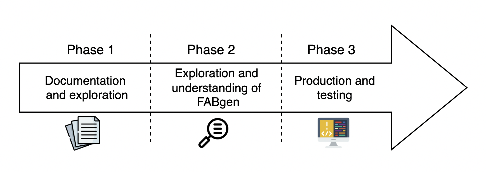
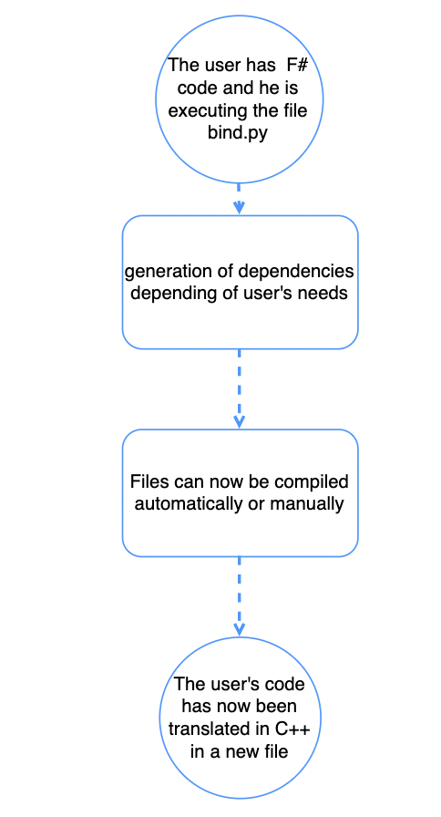
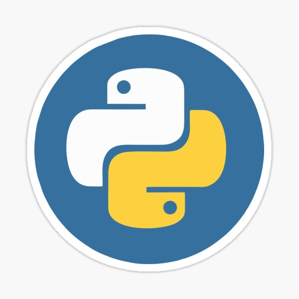
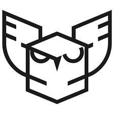

#  Harfang 3D technical specification

Table of content

- [Overview](#overview)
	- [Why this project?](#why-this-project)
	- [Schedule](#schedule)
- [Software](#software)
	- [Software architecture](#software-architecture)
	- [File structure](#file-structure)
- [Risk, assumptions and constraints](#risks-assumptions-and-constraints)
	- [Risks](#risks)
	- [Assumptions](#assumptions)
	- [Constraints](#constraints)
- [testing](#testing)
- [Footnotes](#footnotes)

## Overview

The goal of this project is to translate [FABGen](#FABGen) into [F#](#F#). To do so we will have to understand what is [FABGen](#FABGen) and how it works, moreover, to make it work properly we will have to use three languages which are: 
- [F#](#F#)
- [C++](#C++)
- [Python](#Python)

### Why this project?

[FABGen](#FABGen) is a binding generator whose purpose is to replace SWIG an older binding generator to fit [Harfang 3D](#Harfang3D) goals. It is currently working with [Python](#Python), Lua, and Go. This project aims to add [F#](#F#) and Rust.

### Schedule

The project is divided into three main phases: 

- week 1 to week 2 phase 1: creation of documents and exploration of the subject
- week 2 to week 4 phase 2: Exploration and understanding of [FABGen](#FABGen)
- week 4 to week 6 phase 3: Production of the product

The project has to be finished by the 17 of February 2023.

## Software

### Software architecture 

As you can see above, the user will enter his F# code, then our algorithm will translate the functions in C++, if these functions can't be translated, it will do it in python and then in c++. The remaining code, which is in C++, will finally be send to [Harfang 3D](#Harfang3D).

### File structure

The project must have a good file structure to work properly, it is one of the main points of this project. Thus the files will be structured as it follows :

<pre>
├── lang
	├── __init__.py
	├── cpython.py
	├── go.py
	├── lua.py
	├── xml.py
	<b>└── fsharp.py</b>
├── lib
	├── cpython
	│	├── __init__.py
	│	├── std.py
	│	└── stl.py
	├── lua
	│	├── __init__.py
	│	├── std.py
	│	└── stl.py
	├── xml
	│	├── __init__.py
	│	├── std.py
	│	└── stl.py
	<b>└── fsharp
		├── __init__.py
		├── std.py
		└── stl.py
		</b>
├── bind.py
├── gen.py
├── license.md
└── readme.md	

</pre>

Files named "fsharp" and bold files are what we will have to create during the project.

## Risks, assumptions and constraints

### Risks

This project has few risks, they can be defined as:
- The risk of being late and miss deadlines.
- The risk of misunderstanding FABgen's functions.
- The risk of bad file structure.
- The risk of having wrong test cases wich leads to functions being wrong functions.
- The risk of [FABGen](#FABGen)'s code not being able to run on our machines.

### Assumptions

Several tests using FABGen with the F# binding must be done.
The python language should also be studied to understand FABGen.
The C API created will go through a process of configuration in order to be used.

### Constraints

The project has some constraints, which are:

- F# is a static language, so we need to go through the C language to create the binding.
- F# is also missing some types  compared to C++ or Python, to face this problem we can wrap C++ inside F#, thus it will allow use to use the missing types.

## Testing

Tests are provided by [Harfang 3D](#Harfang3D) so we won't have to create them, but we will have to modify them a bit to adapt them to [F#](#F#).

## Footnotes
|word|definition|
|-----|:----:|
|FABGen   | FABGen is a script written in Python made to create C++ to allow users to code with multiple languages such as Python, Go, and Lua.|
| F#| F# is an object-oriented language which means it can associate a block of a program to a concept, F# is widely used to make multiple languages work together.|
|C++| C++ is a high-level programming language, as F#, C++ is an object-oriented language.|
|Python| Like C++, Python is a high-level language, this language is widely used inside the programming community for his simplicity to use parts of code called libraries which are made by users.|
|Harfang 3D| Harfang 3D is a French company based in Orléans with the objective to create a 3D engine for industrial companies and purposes less explored by his concurrence. Harfang 3D is also the name of their 3D engine. |

###### [all icons used are made by professionals and are available on Flaticon](https://www.flaticon.com/)
